# Frontloops Challenge

[Frontloops](https://frontloops.io) is a front-end challenge site by Dimitry Belyaev, a Sr. FE Dev at Booking.com. As part of the challenge you get an image/video file of the final design then off you code.

I've decided to hone my FE skills a bit whilst also **practicing some UX Design by also tweaking the designs** if and when needed.

## Markup challenges
To improve HTML and CSS skills.

### Day 1 - Plan Picker

The original design:

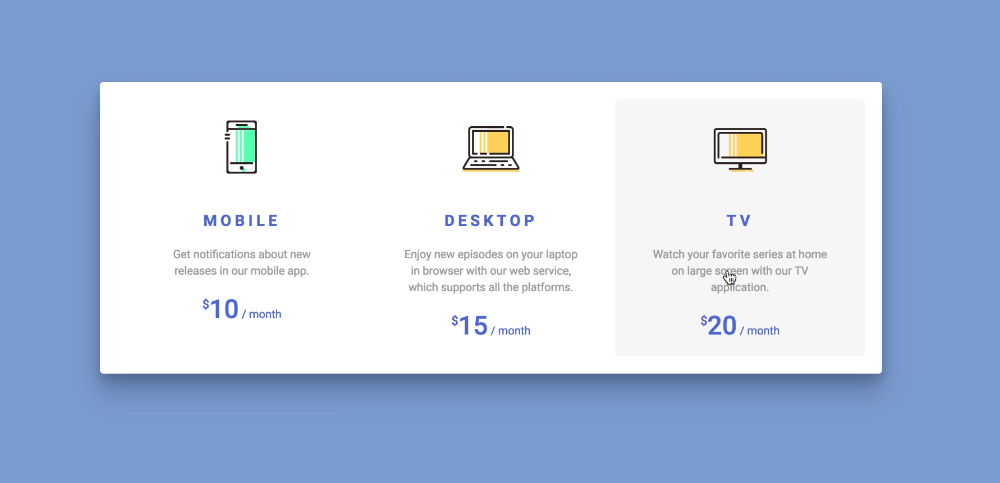

My design:


🤖 [The code](1-plan_picker/)

🧐 <a href="https://krisztin.github.io/ui-vs-ux-frontoff/1-plan_picker/" target="_blank" rel="noopener noreferrer">See it in action</a>

#### UX redesign

- changed uppercase text to normal for readability
- added an h1 to explain the selection
- slightly larger text (suggested base font-size was 14px 🔬 which is waaaay too tiny)
- more contrasting font colour for the description


### Day 2 - Payment method picker

The original design:

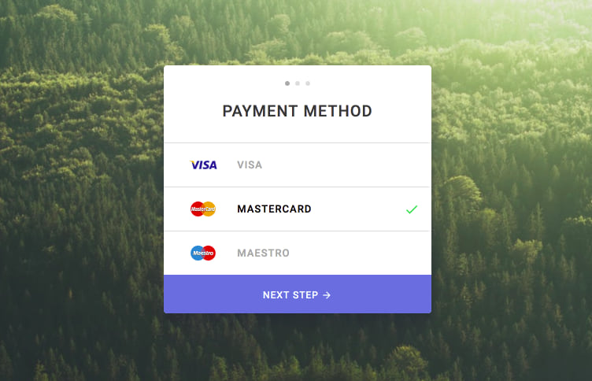

My design:

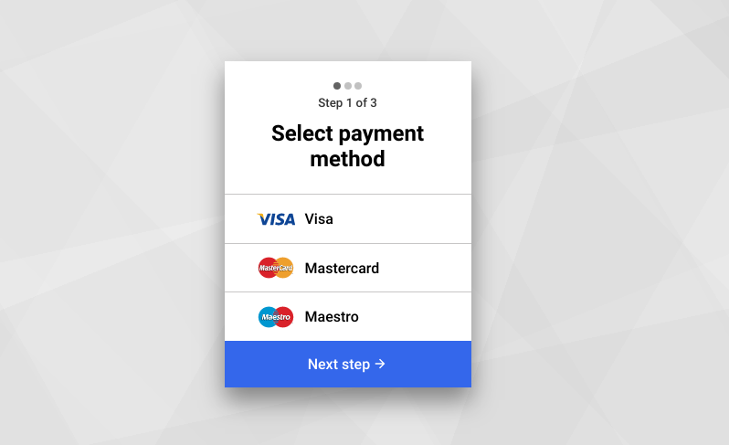

🤖 [The code](2-payment_method/)

🧐 <a href="https://krisztin.github.io/ui-vs-ux-frontoff/2-payment_method/" target="_blank" rel="noopener noreferrer">See it in action</a>

#### UX redesign

- unchecked inputs' labels are still black; design suggested grey but that could potentially confuse users thinking the option is disabled
- made the container narrower so the checkmark is closer to the label instead of miles away on the right
- design called for all text to be uppercase which is hell on readability
- checked label gets physically larger to give better feedback on it being selected

### Day 3 - Order thank you page

The original design:

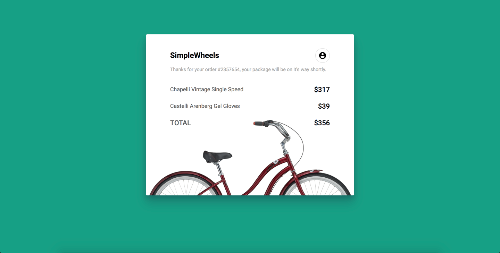

My design:

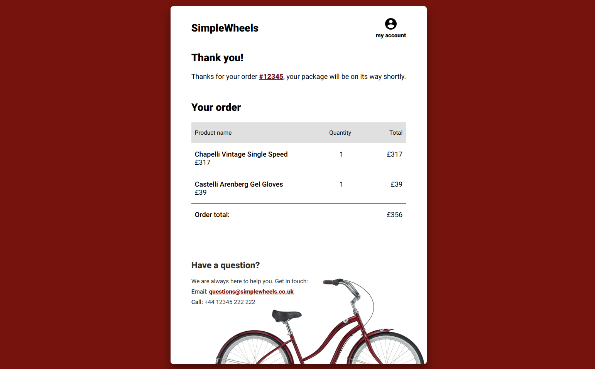

🤖 [The code](3-order_thanks/)

🧐 <a href="https://krisztin.github.io/ui-vs-ux-frontoff/3-order_thanks/" target="_blank" rel="noopener noreferrer">See it in action</a>

#### UX redesign

Information enrichment:

- **'my account' label** for the account icon, because icon+label is superior to icon or label only.
- **Thank you heading text** for the skimmers as a quick feedback that all is well.
- **Headers for the order summary** 'table' (i.e. Product name, Quantitiy).
- Quantity column... 🙄
- **Individual price** displayed under the product's name.
- A **CTA to get in touch**, just in case something went wrong or the user has a question about the order.

Wanted to add:
- Thumbnail image of the product

Layout/accessibility:
- **Moved the background image bicycle** so it doesn't overlap with the order details. It's positioned that it also never interferes with the `contact` section.
- **Didn't use a table** for the summary due to accessibility concerns (not just the lack of a consistent way to be read by screen readers but how unpredictable tables are when it comes to sizing on smaller screens).
- Each order item also has an **accessibility text paragraph that collates all the information** in the table/line into one single, uninterrupted paragraph.

```html

<!-- This garble below is hidden for screen readers to avoid confusion -->
<div class="row" aria-hidden="true">
  <p class="col-6">
    <span class="product-name">Castelli Arenberg Gel Gloves</span>
    <span class="product-price">£39</span>
  </p>
  <p class="align--centre col-2">1</p>
  <p class="align--right col-2">£39</p>
</div>

<!-- Instead, screen readers will read this line -->
<p class="a11ytxt">1, Castelli Arenberg Gel Gloves, £39</p>

```

### Day 4 - Blocked on Messenger

**The original design:**

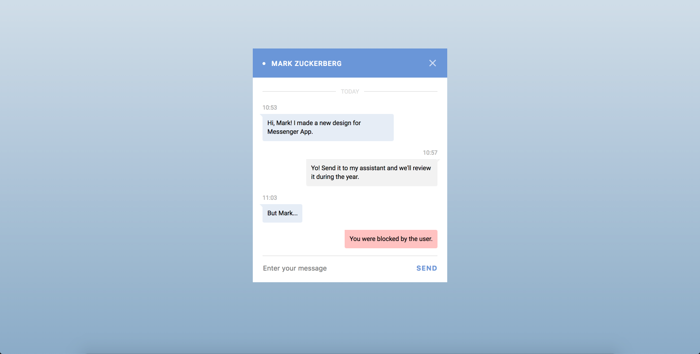

**My design:**

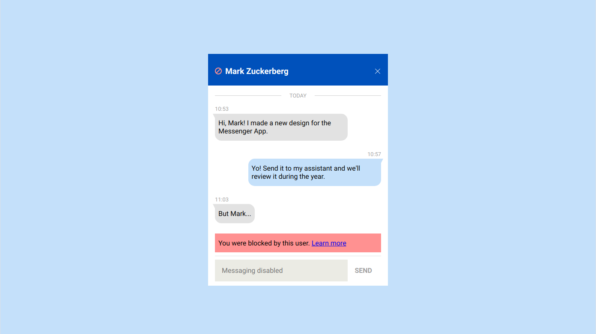

🤖 [The code](4-messenger/)

🧐 <a href="https://krisztin.github.io/ui-vs-ux-frontoff/4-messenger/" target="_blank" rel="noopener noreferrer">See it in action</a>

#### UX redesign

- Added a `blocked` status indicator icon next to the contact's name.
- Full width system message.
- Link to more info on being blocked *(with accessible text added on at the end to complete the text to: "Learn more about the blocked status.")*
- Disabled the `input field` and `send button` as well.
  
### Day 5 - Boarding pass

**The original design:**

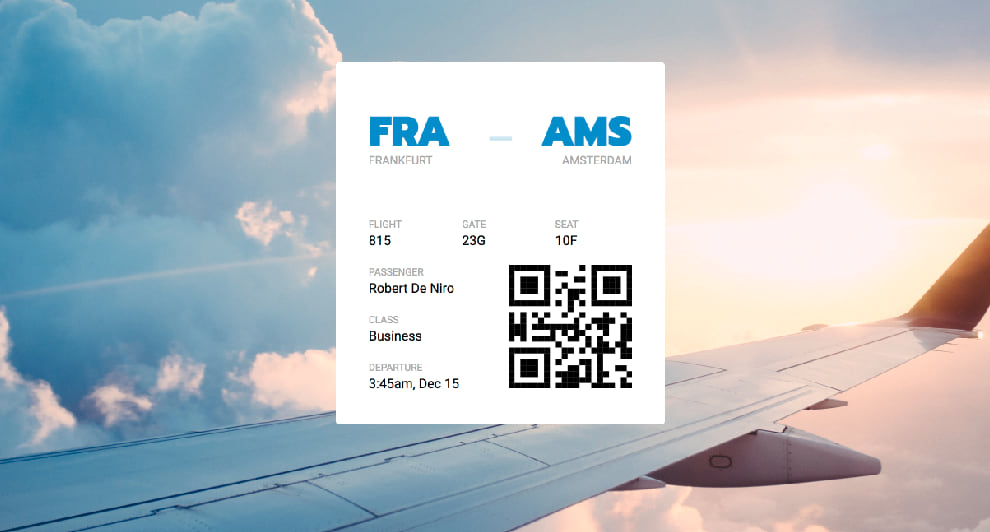

**My design:**

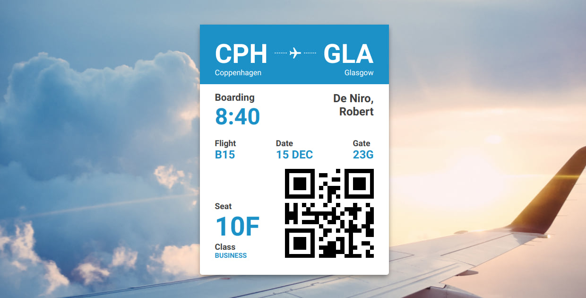

🤖 [The code](5-boarding_pass/)

🧐 <a href="https://krisztin.github.io/ui-vs-ux-frontoff/5-boarding_pass/" target="_blank" rel="noopener noreferrer">See it in action</a>

#### UX redesign

- Information hierarchy: seat, boarding time and airports get priority.
- Passenger name positioned to allow for longer names.
- Broke `departure` into `date` and `boarding` time.
- Headings are not uppercase, instead the information is (as most already is such as gate, flight number, seat).

Broken up to sections as you travel through the airport from airport names, flight number and gate to the QR code to check-in then your class and seat.


### Day 6 - Sign up Oauth + email

**The original design:**

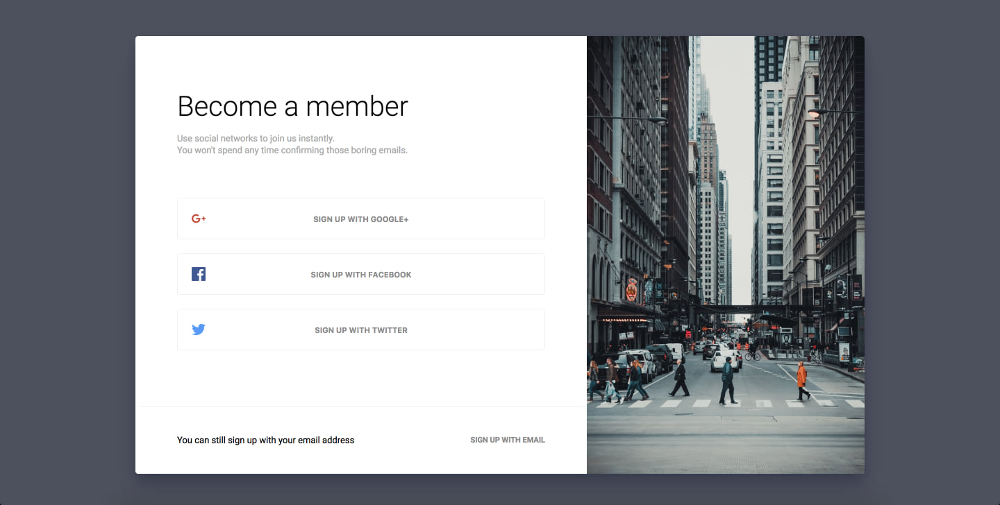

**My design:**

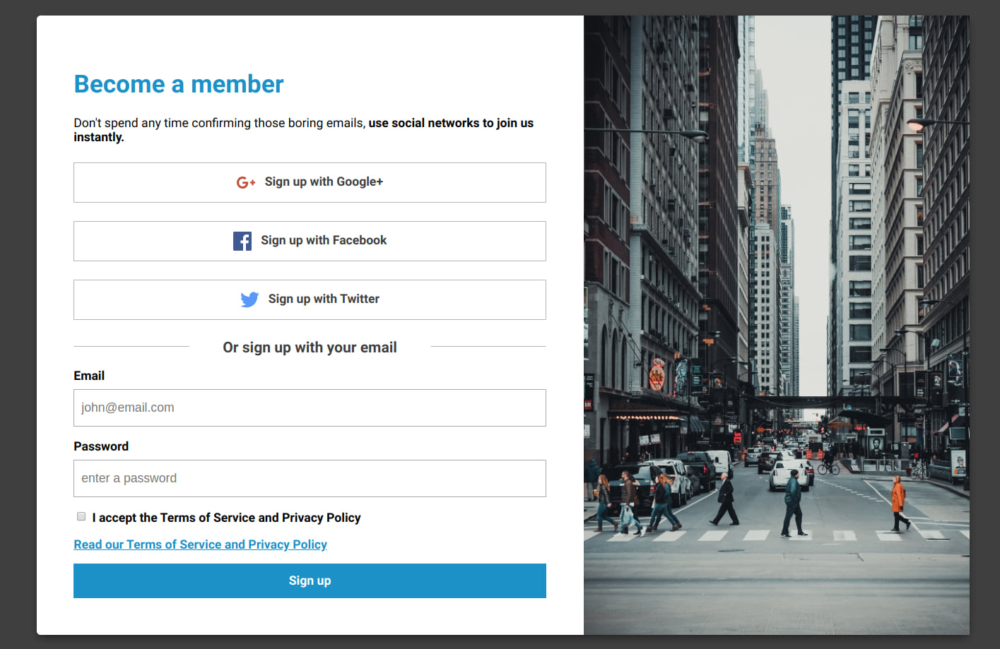

🤖 [The code](6-sign_up/)

🧐 <a href="https://krisztin.github.io/ui-vs-ux-frontoff/6-sign_up/" target="_blank" rel="noopener noreferrer">See it in action</a>

#### UX redesign

- Got rid of the allcaps buttons for readability.
- positioned social icons next to the button text.
- Added a heading for the email sign up along with a form for quick sign up.
- Added the TOS link because I just **love** the law.
- Following accessibility best practices the *Read our Terms and Service and Privacy Policy* link is not inside the checkbox.

As you can see from the above design solution I'm not a fan of almost explicitly hiding features. On the original design the email sign up is so different in layout/design that it's easy to miss. But **to be true to business needs I did code another version**. And because I'm missing including Javascript in these designs I've added a few lines of JS to deal with switching `display:none` on the sign up form to `block` and it even transforms 🧙‍♂️ 

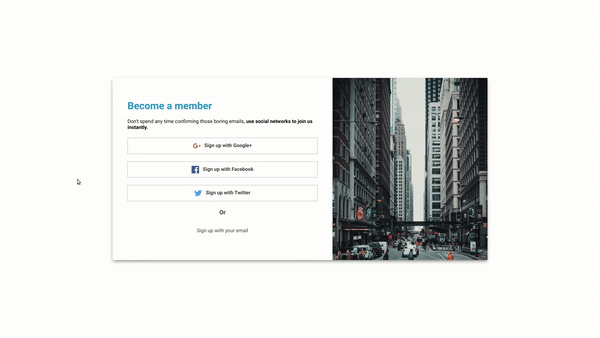

🧐 <a href="https://krisztin.github.io/ui-vs-ux-frontoff/6-sign_up/" target="_blank" rel="noopener noreferrer">See this alternate sign up page in action</a>

🤖 [The code](6-sign_up/index_v2.html)
