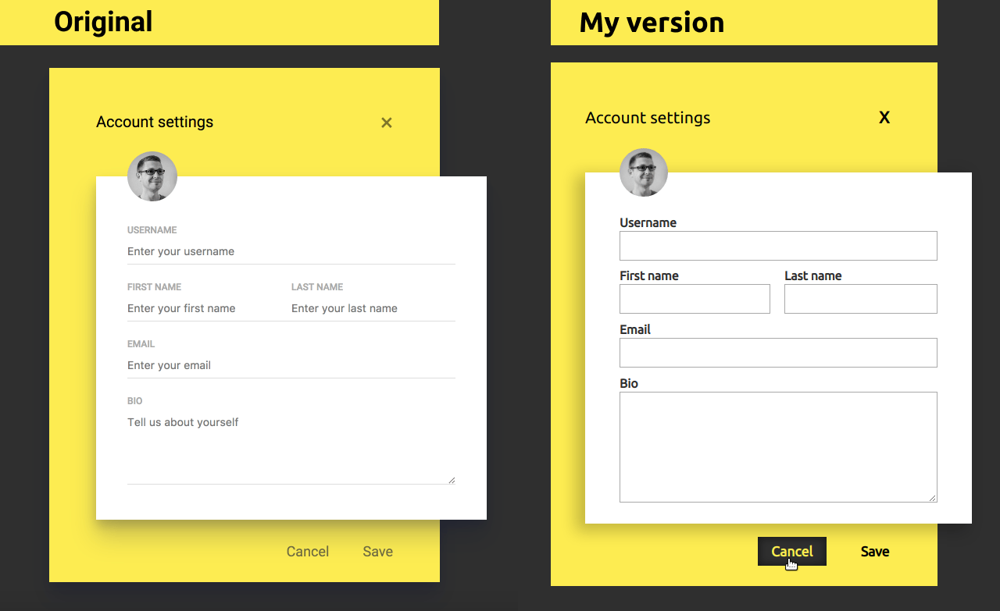
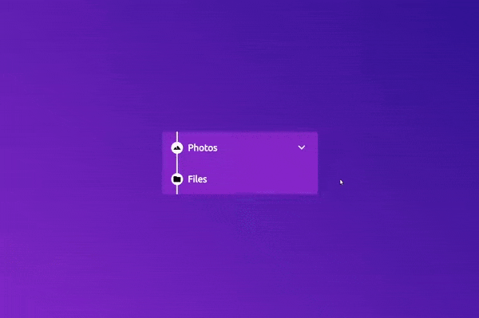
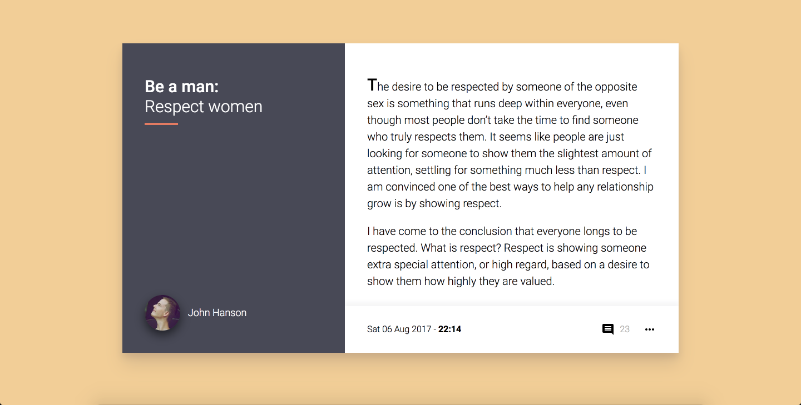
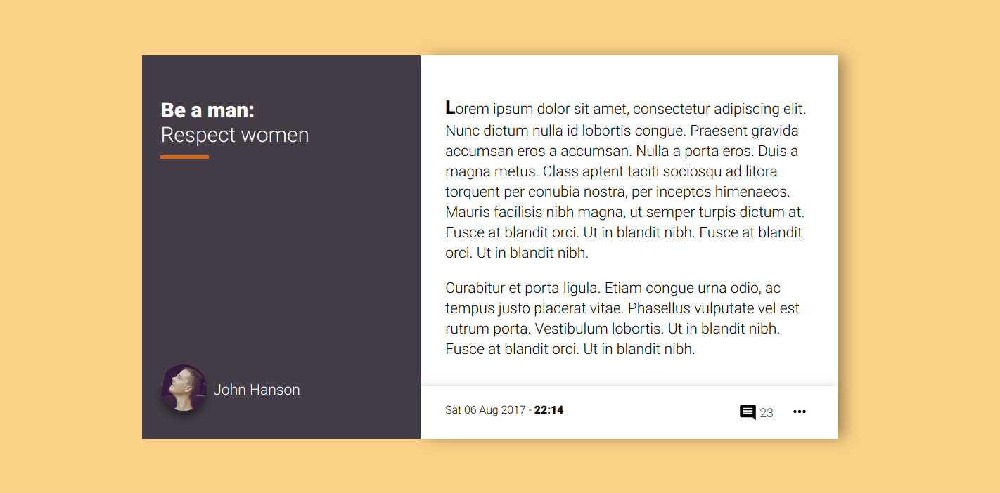
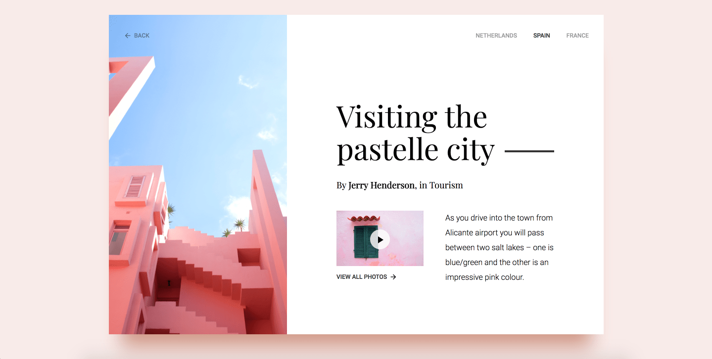
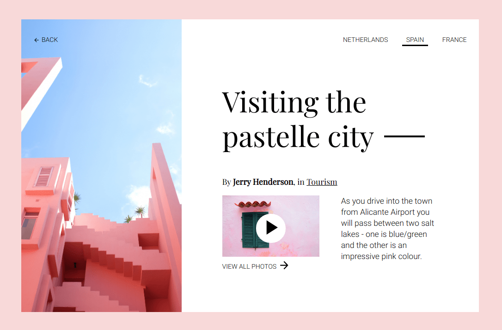

# Frontloops Challenge <!-- omit in toc -->

[Frontloops](https://frontloops.io) is a front-end challenge site by Dimitry Belyaev, a Sr. FE Dev at Booking.com. As part of the challenge you get an image/video file of the final design then off you code.

I've decided to hone my FE skills a bit whilst **also practicing some UX Design by tweaking the designs** as well if and when needed.

## Markup challenges <!-- omit in toc -->
To improve HTML and CSS skills.

- [Sign up Oauth + email](#sign-up-oauth--email)
- [Order thank you page](#order-thank-you-page)
- [Digital wallet](#digital-wallet)
- [Blocked on Messenger](#blocked-on-messenger)
- [Account settings](#account-settings)
- [Folders](#folders)
- [Payment method picker](#payment-method-picker)
- [Boarding pass](#boarding-pass)
- [Blog post](#blog-post)
- [A pink article](#a-pink-article)
- [Plan Picker](#plan-picker)

### Sign up Oauth + email

Original vs my design:


🤖 [The code](6-sign_up/)

🧐 <a href="https://krisztin.github.io/ui-vs-ux-frontoff/6-sign_up/" target="_blank" rel="noopener noreferrer">See it in action</a>

#### UX redesign  <!-- omit in toc -->

- Got rid of the allcaps buttons for readability.
- positioned social icons next to the button text.
- Added a heading for the email sign up along with a form for quick sign up.
- Added the TOS link because I just **love** the law.
- Following accessibility best practices the *Read our Terms and Service and Privacy Policy* link is not inside the checkbox.

As you can see from the above design solution I'm not a fan of almost explicitly hiding features. On the original design the email sign up is so different in layout/design that it's easy to miss. But **to be true to business needs I did code another version**. And because I'm missing including Javascript in these designs I've added a few lines of JS to deal with switching `display:none` on the sign up form to `block` and it even transforms 🧙‍♂️ 


🧐 <a href="https://krisztin.github.io/ui-vs-ux-frontoff/6-sign_up/" target="_blank" rel="noopener noreferrer">See this alternate sign up page in action</a>

🤖 [The code](6-sign_up/index_v2.html)

### Order thank you page

Original vs my design:


🤖 [The code](3-order_thanks/)

🧐 <a href="https://krisztin.github.io/ui-vs-ux-frontoff/3-order_thanks/" target="_blank" rel="noopener noreferrer">See it in action</a>

#### UX redesign  <!-- omit in toc -->

Information enrichment:

- **'my account' label** for the account icon, because icon+label is superior to icon or label only.
- **Thank you heading text** for the skimmers as a quick feedback that all is well.
- **Headers for the order summary** 'table' (i.e. Product name, Quantitiy).
- Quantity column... 🙄
- **Individual price** displayed under the product's name.
- A **CTA to get in touch**, just in case something went wrong or the user has a question about the order.

Wanted to add:
- Thumbnail image of the product

Layout/accessibility:
- **Moved the background image bicycle** so it doesn't overlap with the order details. It's positioned that it also never interferes with the `contact` section.
- **Didn't use a table** for the summary due to accessibility concerns (not just the lack of a consistent way to be read by screen readers but how unpredictable tables are when it comes to sizing on smaller screens).
- Each order item also has an **accessibility text paragraph that collates all the information** in the table/line into one single, uninterrupted paragraph.

```html

<!-- This garble below is hidden for screen readers to avoid confusion -->
<div class="row" aria-hidden="true">
  <p class="col-6">
    <span class="product-name">Castelli Arenberg Gel Gloves</span>
    <span class="product-price">£39</span>
  </p>
  <p class="align--centre col-2">1</p>
  <p class="align--right col-2">£39</p>
</div>

<!-- Instead, screen readers will read this line -->
<p class="a11ytxt">1, Castelli Arenberg Gel Gloves, £39</p>

```

### Digital wallet

Original vs my design:


🤖 [The code](9-wallet/)

🧐 <a href="https://krisztin.github.io/ui-vs-ux-frontoff/9-wallet/" target="_blank" rel="noopener noreferrer">See it in action</a>

#### UX redesign  <!-- omit in toc -->

- The active card got a more signified design.
- As there are two screens, to avoid confusion, the active card number is also displayed under the 'Current Balance' title on the right.
- I've added a few filters just for fun. And they actually work! Once again, I was missing a little JavaScript magic so I went ahead and done that.
- Took off the confusing circle border from the + and - icons on incomes and expenditures because they looked like a button.
- Kept a visible scrollbar on both sides as an affordance to signify more content available if scrolled. Did make it a bit fancier looking though.
- Added a - (minus) sign before money going out so colour is not the only visual feedback on the nature of a balance item.

### Blocked on Messenger

Original vs my design:


🤖 [The code](4-messenger/)

🧐 <a href="https://krisztin.github.io/ui-vs-ux-frontoff/4-messenger/" target="_blank" rel="noopener noreferrer">See it in action</a>

#### UX redesign  <!-- omit in toc -->

- Added a `blocked` status indicator icon next to the contact's name.
- Full width system message.
- Link to more info on being blocked *(with accessible text added on at the end to complete the text to: "Learn more about the blocked status.")*
- Disabled the `input field` and `send button` as well.


### Account settings

Desgins side-by-side



🤖 [The code](10-account_settings/)

🧐 <a href="https://krisztin.github.io/ui-vs-ux-frontoff/10-account_settings/" target="_blank" rel="noopener noreferrer">See it in action</a>

#### UX redesign  <!-- omit in toc -->

This was a great opportunity to improve upon a good looking form with terrible UX design. I wrote an [article about the nuances of human-centred form design](https://www.kriszt.in/blog/a11yform) through making a stunningly designed (not by me) sign in/up form accessible/user-friendly, if you are interested in more detail.

Bottom line is:
- fields should really have 4 borders
- placeholder texts can be confusing to users so best to ditch them. If you want to give instructions you can do so in a paragraph under your label for instance.

Additional stuff (just the usual):
- *grey's, not okay* for button colours as it just makes them look disabled
- STOP SHOUTING AT USERS and help them read your stuff faster.
  
### Folders

Original design:


My design:



🤖 [The code](11-folders/)

🧐 <a href="https://krisztin.github.io/ui-vs-ux-frontoff/11-folders/" target="_blank" rel="noopener noreferrer">See it in action</a>

#### UX redesign  <!-- omit in toc -->

- Just played around with the design a bit creating `:hover`, `:focus` and `:active` states.
- The small triangle arrow on folders that have subfolders is animated/rotated on folder opening/closing.
- Added some depth for the sub-folders with an inset dropshadow.

### Payment method picker

Original vs my design:

)

🤖 [The code](2-payment_method/)

🧐 <a href="https://krisztin.github.io/ui-vs-ux-frontoff/2-payment_method/" target="_blank" rel="noopener noreferrer">See it in action</a>

#### UX redesign  <!-- omit in toc -->

- unchecked inputs' labels are still black; design suggested grey but that could potentially confuse users thinking the option is disabled
- made the container narrower so the checkmark is closer to the label instead of miles away on the right
- design called for all text to be uppercase which is hell on readability
- checked label gets physically larger to give better feedback on it being selected

### Boarding pass

Original vs my design:


🤖 [The code](5-boarding_pass/)

🧐 <a href="https://krisztin.github.io/ui-vs-ux-frontoff/5-boarding_pass/" target="_blank" rel="noopener noreferrer">See it in action</a>

#### UX redesign  <!-- omit in toc -->

- Information hierarchy: seat, boarding time and airports get priority.
- Passenger name positioned to allow for longer names.
- Broke `departure` into `date` and `boarding` time.
- Headings are not uppercase, instead the information is (as most already is such as gate, flight number, seat).

Broken up to sections as you travel through the airport: airport names, flight number, gate and QR code to check-in then your class and seat for boarding.

### Blog post

The original design:



My design:



🤖 [The code](7-blog_post/)

🧐 <a href="https://krisztin.github.io/ui-vs-ux-frontoff/7-blog_post/" target="_blank" rel="noopener noreferrer">See it in action</a>

#### UX redesign  <!-- omit in toc -->

The first design that I haven't meddled with at all (other than change the colour of the comment count which was way too light of a grey to pass WCAG guidelines).

### A pink article

The original design:



My design:



🤖 [The code](8-pink_article/)

🧐 <a href="https://krisztin.github.io/ui-vs-ux-frontoff/8-pink_article/" target="_blank" rel="noopener noreferrer">See it in action</a>

#### UX redesign  <!-- omit in toc -->

- Once again, getting rid of the greys. Very unfortunate colour choice for a navigation.
- Added indication of which page is active with an underline similar to the decorative line next to the article's title.
- Made '*Tourism*' a link to what I assume is a category on the website anyhow.
  
### Plan Picker

Original vs my design:


🤖 [The code](1-plan_picker/)

🧐 <a href="https://krisztin.github.io/ui-vs-ux-frontoff/1-plan_picker/" target="_blank" rel="noopener noreferrer">See it in action</a>

#### UX redesign  <!-- omit in toc -->

- changed uppercase text to normal for readability
- added an h1 to explain the selection
- slightly larger text (suggested base font-size was 14px 🔬 which is waaaay too tiny)
- more contrasting font colour for the description