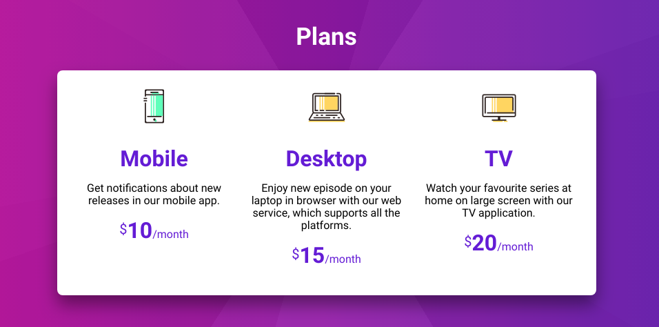

# Frontloops Challenge

[Frontloops](https://frontloops.io) is a front-end challenge site by Dimitry Belyaev, a Sr. FE Dev at Booking.com. As part of the challenge you get an image/video file of the final design then off you code.

I've decided to hone my FE skills a bit whilst also **practicing some UX Design by also tweaking the designs** if and when needed.

## Markup challenges
To improve HTML and CSS skills.

### Day 1 - Plan Picker

The original design:

My design:

🤖 [The code](1-plan_picker/)

🧐 <a href="https://krisztin.github.io/ui-vs-ux-frontoff/1-plan_picker/" target="_blank" rel="noopener noreferrer">See it in action</a>

#### UX redesign

- changed uppercase text to normal for readability
- added an h1 to explain the selection
- slightly larger text (suggested base font-size was 14px 🔬 which is waaaay too tiny)
- more contrasting font colour for the description

### Day 2 - Payment method picker

The original design:

My design:

🤖 [The code](2-payment_method/)

🧐 <a href="https://krisztin.github.io/ui-vs-ux-frontoff/2-payment_method/" target="_blank" rel="noopener noreferrer">See it in action</a>

#### UX redesign

- unchecked inputs' labels are still black; design suggested grey but that could potentially confuse users thinking the option is disabled
- made the container narrower so the checkmark is closer to the label instead of miles away on the right
- design called for all text to be uppercase which is hell on readability
- checked label gets physically larger to give better feedback on it being selected
